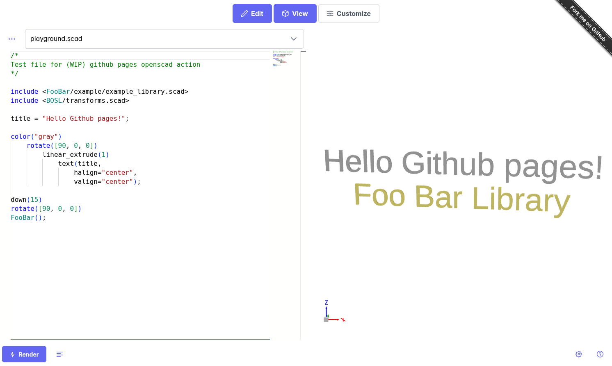

# Openscad Playground Github pages test


Deployed on [http://bobvdv.nl/openscad-gh-pages/](http://bobvdv.nl/openscad-gh-pages/)

Deploys a single openscad file to an online openscad playground using github pages. 

Original openscad playground repo can be found [here](https://github.com/openscad/openscad-playground).

## Usage
In your own Github repository with an openscad project, follow these steps:
1. Enable github pages in the repository settings
2. Write the config below to a yaml in the .github/workflows folder:
    ```
    name: "Deploy openscad file to GH pages"

    permissions:
    contents: read
    pages: write
    id-token: write

    on:
    push:
        branches: ["main"]
    workflow_dispatch: 
    jobs:
    deploy:
        environment:
        name: github-pages
        url: ${{ steps.openscad-deployment.outputs.page_url }}
        runs-on: ubuntu-latest
        steps:
      - name: Checkout pages action
        uses: actions/checkout@v5
        with:
          repository: Bob-vdV/openscad-gh-pages
          path: ./openscad-gh-pages
        - name: Deploy openscad customizer
            uses: ./
            id: openscad-deployment
            with:
                repository: Bob-vdV/openscad-gh-pages # Replace with your repo
                filename: "example/main_file.scad"
                libraries: "example/libraries.json"
    ```
  3. Replace the repository, filename and libraries with yours
